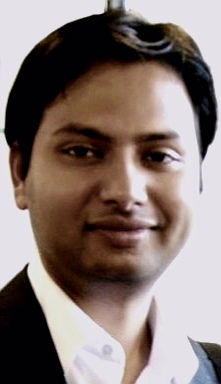
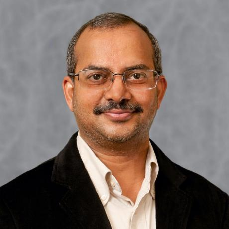

  
 

 

---------------------------------------
 
  
#### Title: MoveTK: The Movement Toolkit

#### Speaker: Aniket Mitra    

#### Abstract:    
Movement data is (geo-)spatial in nature, wherein the location of objects over time is recorded. Such datasets can be predominantly GPS, but can also have other forms like video tracking. The data associated with one moving object forms a trajectory: a sequence of measured locations with the associated time of measurement.

Trajectories can be used to model movement of humans (e.g., people, vehicles, flights, goods transportation) as well as natural entities (e.g., animals, hurricanes). The analysis of such data is important to understand for example, human mobility or how animals behave and interact in their territory, etc. However, the ease with which movement data can be collected these days mean that this type of data has rapidly grown in complexity and volume, much like other forms of data. The complex nature of trajectories requires effective algorithms and tools for processing and understanding movement in general. To facilitate analysis of movement data, we present [MoveTK](https://github.com/heremaps/movetk): an open-source toolkit for analyzing movement data.

MoveTK is a reusable, well tested, high performant, feature-rich library that incorporates state of the art algorithms for computational movement analysis.The library is designed to be extensible such that is can be adapted for various movement analysis tasks. The library has been developed as part of a collaboration between [HERE Technologies](https://www.here.com/), [Eindhoven University of Technology](https://alga.win.tue.nl/) and [Utrecht University](https://www.uu.nl/en/research/algorithms/geometric-computing) under the [Commit2Data](https://commit2data.nl/en/commit2data-program/data-handling/data-science-voor-veranderende-data-2/analysis-and-visualization-of-heterogeneous-spatio-temporal-data) program.

This talk is intended to showcase the scalability of MoveTK to large geo-spatial data sets. Moreover, through visualizations, we will demonstrate the various movement analysis algorithms that are available in MoveTK. Any scalable movement analysis task can be based on three fundamental building blocks: (a) the representation of (geo-)spatial movement data (b) the shape and specifically geometric aspect of movement and (c) algorithms that have theoretical bounds on their time and space complexity. Therefore, we will present the design decisions adopted in MoveTK, that allows seamless interoperability between these fundamental building blocks.

#### Speaker Bio: 
Aniket Mitra is a Lead Research Engineer at HERE Technologies working on algorithms with a focus on movement analysis. He is also responsible for the design and implementation of the core components of MoveTK. Prior to his current position, he has worked in the R&D departments of various companies including a number of startups. Aniket has a Masters degree in Applied Mathematics from Vrije University.

---------------------------------------
 

 

  
#### Title: GeoAI: Recent Advances in Machine Learning for Global Earth Observations

#### Speaker: Dr. Ranga Raju Vatsavai    

#### Abstract:    
Global earth observations with constellation of more than 100 operational satellites are providing unprecedented spatiotemporal data coverage, which can be exploited to continuously monitor key resources. Earth is a dynamical system continually changing due to both natural and human induced factors. Recent decade has witnessed major changes on the Earth, for example, deforestation, varying cropping and human settlement patterns, and crippling damages due to disasters. Monitoring this dynamic phenomenon is critical for human wellbeing. In this talk we will explore recent advances in AI and machine learning for monitoring natural and as well as man-made structures from local to global scales.

#### Speaker Bio: 
Dr. Raju Vatsavai is a Chancellor’s Faculty Excellence Program Cluster Associate Professor in the Computer Science department at the North Carolina State University.

He works at the intersection of spatial and temporal big data management, analytics, and high-performance computing with applications in the national security, geospatial intelligence, natural resources, climate change, location-based services, and human terrain mapping. As the Associate Director of the Center for Geospatial Analytics (CGA), Raju plays a leadership role in the center’s strategic vision for spatial computing research. 

He has published more than 100 peer-reviewed articles in conferences and journals and edited two books on “Knowledge Discovery from Sensor Data.” He served on program committees of leading international conference including ACM KDD, ACM GIS, ECML/PKDD, SDM, CIKM, IEEE BigData, and co-chaired several workshops including ICDM/SSTDM, ICDM/KDCloud, ACM SIGSPATIAL BigSpatial, Supercomputing/BDAC, KDD/LDMTA, KDD/Sensor-KDD, and SDM/ACS. He holds MS and PhD degrees in computer science from the University of Minnesota. At present, he is on leave from the NCSU and working as Distinguished Research Fellow at Lirio.

---------------------------------------

 
 

